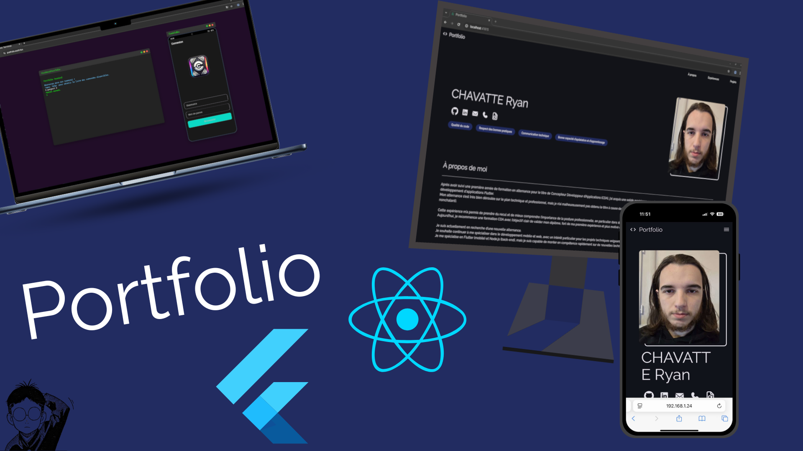

# Portfolio

 

> À l’origine, le projet prenait la forme d’un terminal web en React pour présenter mon profil. Cependant, après avoir constaté que ce format n'était pas très intuitif pour un recruteur non technique, j’ai conçu une version plus classique et responsive avec Flutter.  
> J’en ai également profité pour développer une API personnelle (**personal-api**), afin de centraliser et exposer mes données (informations personnelles, expériences, projets, etc.), rendant le site plus facilement maintenable et évolutif.

## Repos GitHub

Voici les différents repos liés à ce portfolio :  

- **Terminal Web (ancienne version)** : [lien du repo](https://github.com/ASD-9/portfolio_terminal)  
- **Application Flutter (version actuelle)** : [lien du repo](https://github.com/ASD-9/portfolio_app)  
- **Backend Terminal Web** : [lien du repo](https://github.com/ASD-9/portfolio_backend)  
- **API personnelle (personal-api)** : [lien du repo](https://github.com/ASD-9/personal-api)  
- **Environnement (Docker Compose)** : [lien du repo](https://github.com/ASD-9/portfolio-env) 

## Portfolios en ligne

- **Version Flutter (actuelle)** : [lien du site](https://portfolio.asd9.fun)  
- **Version Terminal Web (ancienne)** : [lien du site](https://portfolio-terminal.asd9.fun)  

## Technologies

- **Frontend** : Flutter, React  
- **Backend / API** : Express, MySQL  
- **Tests / Qualité** : Jest, SonarQube  
- **CI/CD / Conteneurisation** : GitHub Actions, Docker  
